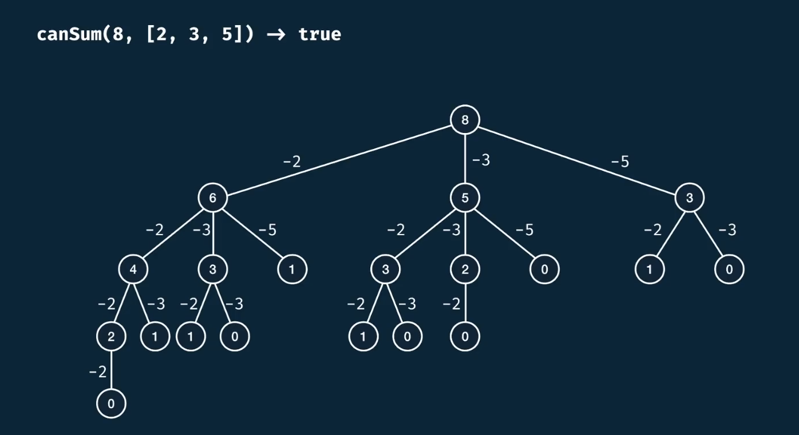
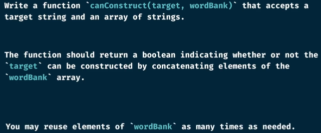

# 1.O(n)
 

# 2.Fibnacci

# 3.gridTraveler

The default setting is as below:
| scenario   | value  |
|  ----  | ----  |
| gridTraveler(1,1)  | 1 |
| gridTraveler(1,0)  | 0 |
| gridTraveler(0,1)  | 0 |
| gridTraveler(0,9)  | 0 |
| gridTraveler(9,0)  | 0 |

# 4. canSum

#### time complexity

The height of the tree is target,because in the worest case the target could be consist only number one.And for each tree node, it will have the length of the array's branches
so the  time and space complexity will be like below:

time: O(n^m) represent: each tree node has n branches and the depth of the tree is m
space :O(m) because it's a recursive method and each time it only takes m space

memorized:

# 5. howSum

# 6. bestSum
 
 

 # 7.canConstruct
 

 # 8.fibnacci with Array:
 
 